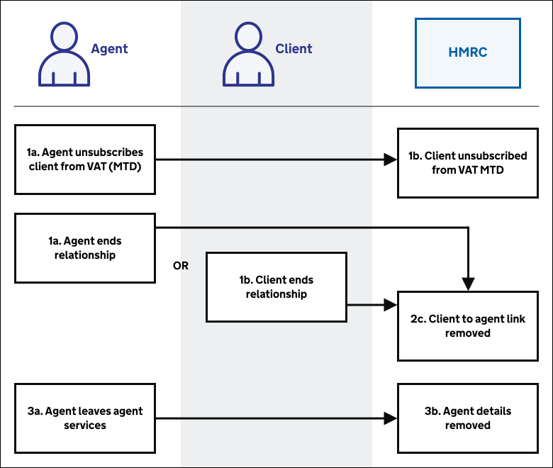
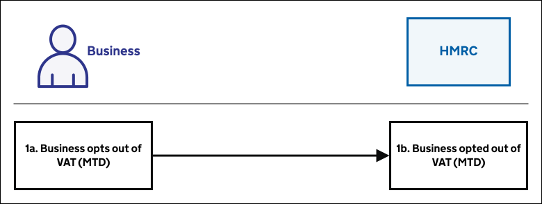

# Close down

## Agent overview

Agent client relationships can end or agents can go out of business.

<a href="figures/close-down-agent-overview.svg" target="blank">Open the agent close down process diagram in a new tab</a>.

1. [Agent unsubscribes client from VAT (MTD)](#unsubscribe-from-vat-mtd)
1. [Client or agent ends relationship](#client-or-agent-ends-relationship)
2. [Agent leaves agent services](#agent-leaves-agent-services)

## Business overview

Businesses unsubscribes from VAT (MTD).

<a href="figures/close-down-business-overview.svg" target="blank">Open the business close down process diagram in a new tab</a>.

1. [Business unsubscribes from VAT (MTD)](#unsubscribe-from-vat-mtd)

## Unsubscribe from VAT (MTD)

Businesses who signed up for VAT (MTD) on a voluntary basis can request to unsubscribe from VAT (MTD).

Initially there is a manual process in place whereby a business or agent can contact our HMRC helpline to notify us they wish to unsubscribe from the service.

In the event that the business continues to be VAT registered, if necessary VAT Returns can
be submitted manually.

In time the manual process will be replaced by a digital service.

## Client or agent ends relationship

### Client breaks agent link

1. Client signs in to Government Gateway for their Business Tax Account
2. Client manages their tax agents
3. Client removes authorisation from an agency
4. Client confirms removal of authorisation from that agency

### Agent breaks client link

Agents will be able to do this using their agent services account.

## Agent leaves agent services

This will initially be the usual process, which can be used to remove the agent reference number and Government Gateway enrolment (HMRC-AS-AGENTS).

The scenario where this is needed is when an agency ceases trading.

If an agency no longer wants to participate in VAT (MTD), they can stop using their Government Gateway ID. We are currently working to include a digital journey as part of the wider change of circumstances solution.
