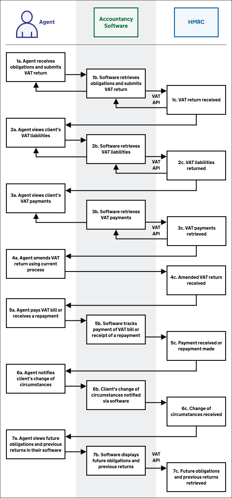
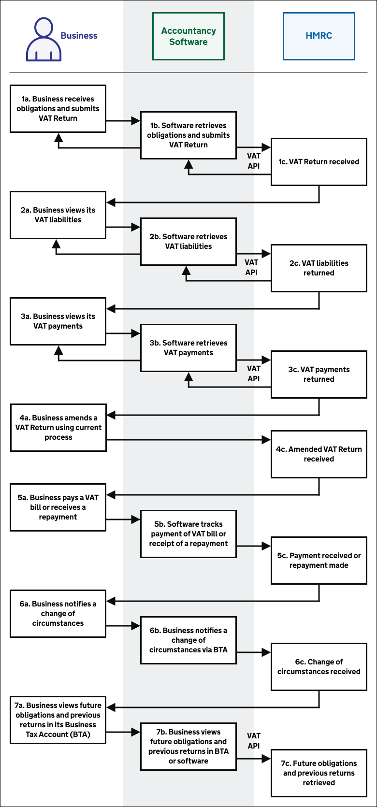
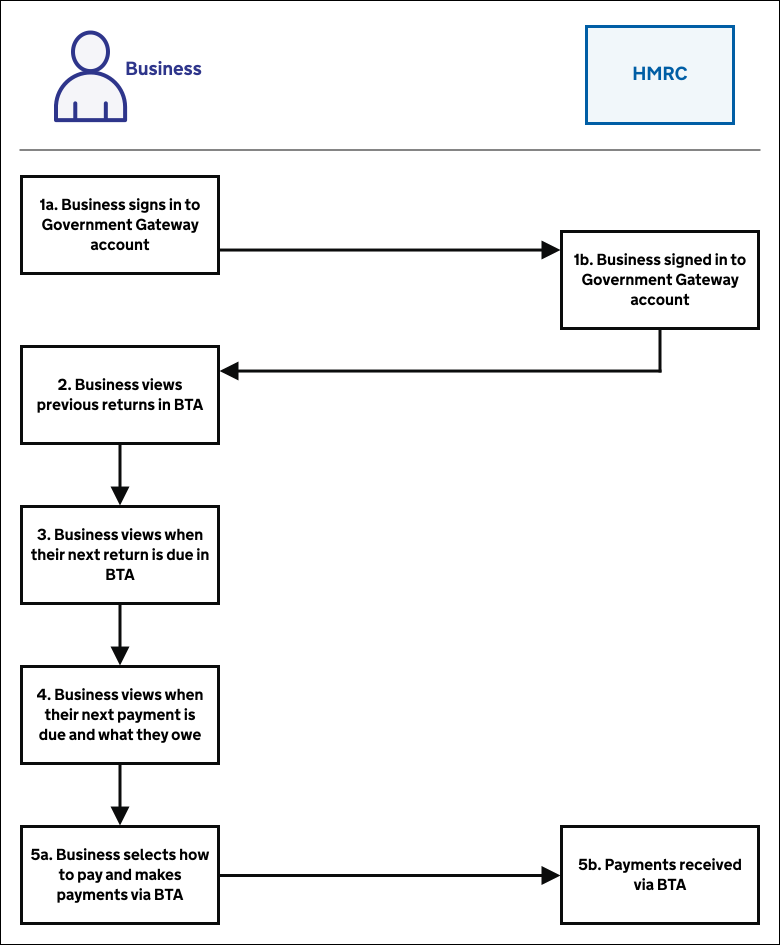

# Obligations and returns

## Agent journey overview
<!--- Section owner: MTD API --->

Agents who have set up their clients for VAT (MTD) can submit their clients' VAT Returns.

<a href="figures/obligations-returns-agent.svg" target="blank"></a>

<a href="figures/obligations-returns-agent.svg" target="blank">Open the agent process flow process diagram for obligations and returns in a new tab</a>.

1. [Agent receives client's obligations and submits a VAT return](#receive-obligations-and-submit-a-vat-return)
2. [Agent views client's VAT liabilities](#view-vat-liabilities) 
3. [Agent views client's VAT payments](#view-vat-payments) 
4. [Agent amends client's VAT return using current process](#amend-a-vat-return-using-current-process)
5. [Agent pays client's VAT bill or receives a repayment](#pay-vat-or-get-a-repayment)
6. [Agent notifies client’s change of circumstances](#notify-a-change-of-circumstances)
7. [Agent views their client's future obligations and previous returns in software](#view-future-obligations-and-previous-returns-bta)

## Business journey overview
<!--- Section owner: MTD API --->

Businesses set up for VAT (MTD) can submit VAT Returns.

<a href="figures/obligations-returns-business.svg" target="blank"></a>

<a href="figures/obligations-returns-business.svg" target="blank">Open the business process flow process diagram for obligations and returns in a new tab</a>.

1. [Business receives obligations and submits VAT Return](#receive-obligations-and-submit-a-vat-return)
2. [Business views its VAT liabilities](#view-vat-liabilities) 
3. [Business views its VAT payments](#view-vat-payments) 
4. [Business amends a VAT Return using current process](#amend-a-vat-return-using-current-process)
5. [Business pays a VAT bill or receives a repayment](#pay-vat-or-get-a-repayment)
6. [Business notifies a change of circumstances](#notify-a-change-of-circumstances)
7. [Business views future obligations and previous returns in its Business Tax Account (BTA)](#view-future-obligations-and-previous-returns-bta)

## Receive obligations and submit a VAT Return
<!--- Section owner: MTD API --->

Your software should use the [VAT (MTD) API](https://developer.service.hmrc.gov.uk/api-documentation/docs/api/service/vat-api/1.0) to do this - specifically the following endpoints:

  * [Retrieve VAT obligations](https://developer.service.hmrc.gov.uk/api-documentation/docs/api/service/vat-api/1.0#_retrieve-vat-obligations_get_accordion)
  * [Submit VAT return for period](https://developer.service.hmrc.gov.uk/api-documentation/docs/api/service/vat-api/1.0#_submit-vat-return-for-period_post_accordion)

1. Mandatory: Business or agent uses their software to retrieve VAT obligations using the [VAT (MTD) API retrieve VAT obligations endpoint](https://developer.service.hmrc.gov.uk/api-documentation/docs/api/service/vat-api/1.0#_retrieve-vat-obligations_get_accordion).
2. Mandatory: Business or agent uses their software to submit a VAT return using the [VAT (MTD) API submit VAT return for period endpoint ](https://developer.service.hmrc.gov.uk/api-documentation/docs/api/service/vat-api/1.0#_submit-vat-return-for-period_post_accordion).
3. Optional: Business or agent uses their software to retrieve VAT obligations again using the [VAT (MTD) API retrieve VAT obligations endpoint](https://developer.service.hmrc.gov.uk/api-documentation/docs/api/service/vat-api/1.0#_retrieve-vat-obligations_get_accordion) to check if the VAT Return has met the current obligation - or to see the next obligation.

### Retrieve obligations in software


The [Retrieve VAT obligations endpoint](https://developer.service.hmrc.gov.uk/api-documentation/docs/api/service/vat-api/1.0#_retrieve-vat-obligations_get_accordion) allows your software to search for obligations based on a start and end date range and an obligation status - O for open, F for fulfilled, or blank for both.

If the status is:

  * F (fulfilled) - the response includes the received date
  * O (open) - the response includes the due date
  * blank - the response includes both open and fulfilled obligations

The response also includes the relevant period key associated with each specific obligation.

A new obligation is generated on the first day of the period, whether the previous obligation has been fulfilled or not. Software can search for previous open or fulfilled obligations **within a 366 day date range** but can only call the next obligation.

**Notes:**

* VAT (MTD) will support more business types throughout public beta. As they are supported, this endpoint will return obligation information for businesses that are on monthly, annual and other non-standard staggers.
* The obligations are returned with the most up to date obligation first. As the next obligation is created at the beginning of the period, it is likely that the period you are trying to file against could be provided second (see example).
* Period keys should not be shown to the business or agent, these are for software use to ensure the return is recorded against the correct obligation.
* If the software submits a VAT Return from Monday to Friday during normal working hours, the obligation will be updated by the following morning or earlier. If the software submits a return after 6pm on a Friday, then it's possible the obligation will be marked as fulfilled on the following Tuesday (or Wednesday if it's a bank holiday weekend). There should be no penalty if the return was submitted in the required timeframe as the obligation will be marked as met on the date it is received from the software.

### Example period keys for stagger types

**Monthly:**

18AD 30.04.2018<br/>
18AE 31.05.2018<br/>
18AF 30.06.2018

**Quarterly:**

18A1 30.04.2018<br/>
18A2 31.07.2018<br/>
18A3 31.10.2018<br/>
18A4 31.01.2019

Note we have not yet configured annual period keys as annual accounting is not in scope for MVP.

The period key is the ID code for the period that this obligation belongs to. The format is a string of four alphanumeric characters. Occasionally for special periods, the format includes a # symbol (e.g. #001), so the period key must be percent-encoded, for example 18AD, 18A1, %23001.

### Example format of returned obligations

```js
{
  "obligations":[
    {
      "start":"2018-11-01",
      "end":"2019-01-31",
      "due":"2019-03-07",
      "status":"O",
      "periodKey":"18A4"
    },
    {
      "start":"2018-08-01",
      "end":"2018-10-31",
      "due":"2018-12-07",
      "status":"O",
      "periodKey":"18A3"
    }
  ]
}
```

### Submit a VAT Return with a declaration through software

This is the only POST API endpoint. The data items required are the same as the current 9 Box return. The period key that is relevant to the obligation needs to be provided as part of the return.

We require your software to show your businesses or agents a declaration that they must confirm before it sends the return to us at HMRC. Software should tell us that the business or agent confirmed this declaration by setting the “finalised” boolean to “true” in the VAT (MTD) API call. We will not accept the VAT Return without this.

 > **Declaration text to use when a business confirms submission**

 > When you submit this VAT information you are making a legal declaration that the information is true and complete. A false declaration can result in prosecution.

 > **Declaration text to use when an agent confirms the submission**

 > I confirm that my client has received a copy of the information contained in this return and approved the information as being correct and complete to the best of their knowledge and belief.

## View previously submitted VAT Return
<!--- Section owner: MTD API --->

Your software can retrieve returns submitted up to four years previously using the VAT (MTD) API:

1. Find the period key for the VAT Return you wish to retrieve, using the [Retrieve VAT obligations endpoint](https://developer.service.hmrc.gov.uk/api-documentation/docs/api/service/vat-api/1.0#_retrieve-vat-obligations_get_accordion) (/organisations/vat/{vrn}/obligations) with the status field set to F to see all fulfilled obligations within a date range, or left blank to see both open and fulfilled obligations.

2. Use the period key with the [View VAT Returns endpoint](https://developer.service.hmrc.gov.uk/api-documentation/docs/api/service/vat-api/1.0#_view-vat-return_get_accordion)  (/organisations/vat/{vrn}/returns/{periodKey}) to retrieve the required VAT Return.

Your software cannot retrieve returns filed before business or agents joined VAT (MTD) through the VAT (MTD) API.

Businesses can also view their previously submitted VAT Returns in their Business Tax Account.

**Note:**

If the software submitted a VAT Return from Monday to Friday during normal working hours, you can use the API to provide a view of the return by the following morning or earlier. If the software submitted a return after 6pm on a Friday, then the return might not be viewable until the following Tuesday, or Wednesday if a bank holiday weekend. If the return was received within the required time frame, no penalty should have occurred, because the obligation would have been marked as met on the date it was received.

## View VAT liabilities
<!--- Section owner: MTD API --->

Your software can retrieve VAT liabilities by calling the VAT (MTD) API [Retrieve VAT liabilities endpoint](https://developer.service.hmrc.gov.uk/api-documentation/docs/api/service/vat-api/1.0#_retrieve-vat-liabilities_get_accordion), which returns the liabilities and charges whose To date falls in the requested date range (of up to 366 days).

The response includes the charge type of the liability, the original amount, and if applicable the outstanding amount owing and the due date for payment.

**Note:**

If the software submits a VAT Return from Monday to Friday during normal working hours, the most up to date liability will be available to view by the following morning or earlier. If the software submits a return after 6pm on a Friday, then the most up to date liability might only be visible on the following Tuesday, or Wednesday if a bank holiday weekend.

## View VAT payments
<!--- Section owner: MTD API --->

Your software can retrieve VAT payments by calling the VAT (MTD) API [Retrieve VAT payments endpoint](https://developer.service.hmrc.gov.uk/api-documentation/docs/api/service/vat-api/1.0#_retrieve-vat-payments_get_accordion), which returns payments that have been used to offset liabilities whose To date falls in the requested date range (of up to 366 days).

The response includes the amount allocated to a liability and, when available, the date it was received.

It is not yet possible to return links between payments and liabilities.

**Note:**

If a payment is made from Monday to Friday during normal working hours, the payment record will be updated by the following morning or earlier. If a payment is made after 6pm on a Friday, then the payment record might only be updated on the following Tuesday, or Wednesday if a bank holiday weekend. If the payment is received within the required time frame, no penalty should occur, because the payment will be marked as received on the date that the payment was made.

## Amend a VAT Return using current process
<!--- Section owner: MTD Programme --->

Businesses and agents should use the [current process](https://www.gov.uk/government/publications/vat-notice-70045-how-to-correct-vat-errors-and-make-adjustments-or-claims/vat-notice-70045-how-to-correct-vat-errors-and-make-adjustments-or-claims#VAT-errors-submitted) for correcting errors on a submitted VAT Return:

  * If the net value of the errors is below £10,000, or between £10,000 and £50,000 and does not exceed 1% of the box 6 amount, the business or agent can adjust their current VAT Return [(method 1)](https://www.gov.uk/government/publications/vat-notice-70045-how-to-correct-vat-errors-and-make-adjustments-or-claims/vat-notice-70045-how-to-correct-vat-errors-and-make-adjustments-or-claims#Method-1)
  * If the net value of the errors is greater than that, the business or agent must notify HMRC in writing with full details of the errors [(method 2)](https://www.gov.uk/government/publications/vat-notice-70045-how-to-correct-vat-errors-and-make-adjustments-or-claims/vat-notice-70045-how-to-correct-vat-errors-and-make-adjustments-or-claims#method-2)

A business or agent can choose to use method 2 and notify HMRC separately in any case.

We encourage you to make businesses and agents aware of these methods.

## Pay VAT or get a repayment
<!--- Section owner: Payments --->

We would like software developers to give businesses and agents the option to make VAT payments at key points in their journey.

There are multiple ways to pay a VAT bill, listed on GOV.UK at [Pay your VAT bill](https://www.gov.uk/pay-vat), each taking different amounts of time to clear. We advise software developers to ask businesses and agents to visit that link so they can make a payment in the method that best suits them to meet the deadline.

With the arrival of VAT (MTD) the contents of this GOV.UK page are subject to change. Likewise the URL may change in which case we will update the link above.

For businesses to see previous payments they’ve made to us, we would like software developers to encourage them to visit their Business Tax Account (BTA) at [https://www.tax.service.gov.uk/account](https://www.tax.service.gov.uk/account).

Using their BTA businesses can:

  * check any VAT Direct Debit arrangements they have with us
  * make changes, or cancel their Direct Debit
  * set up a new Direct Debit instruction
  * make a corporate credit or debit card payment

This page will also provide details of our bank account for businesses or agents wanting to pay by Bacs, CHAPS or by Faster Payments.

### Agents

Agents can only make a payment via the unauthenticated (not logged in) route - [https://www.tax.service.gov.uk/pay-online/vat](https://www.tax.service.gov.uk/pay-online/vat). This link is accessible from the gov.uk guidance on ['Pay your VAT bill'](https://www.gov.uk/pay-vat).

### Repayments

Repayments to VAT businesses are made by:

1. Card – only if the last payment on record at the time the repayment is due is a card and all other relevant criteria is met. At this time we are only refunding Worldpay transactions back to card. Barclaycard transactions are being repaid by Bacs or Payable Order. This process will continue until we have our new Barclaycard repay to card process in place.
2. Bacs – to the business bank details held on file.
3. Payable Order – if no bank details are held on file.

In exceptional circumstances we repay by CHAPS or Faster Payments but these type of repayments are normally associated with hardship, complaints, etc.

The business’ or agent’s repayment bank account details are only used for a Bacs, CHAPS or Faster Payments repayment.

## Notify a change of circumstances
<!--- Section owner: View and Change --->

We encourage you to remind businesses to check and update their details with us.

They can do this by visiting their Business Tax Account at
[https://www.tax.service.gov.uk/account](https://www.tax.service.gov.uk/account).

Businesses can update a range of information online which includes email address, principle place of business, VAT return dates, repayment bank account details and deregistering from VAT.

Agents who have signed up to MTD and also have a client who is signed up, can [notify a change of circumstances](https://www.tax.service.gov.uk/gg/sign-in?continue=%2Fvat-through-software%2Faccount%2Fchange-business-details&origin=manage-vat-subscription-frontend).

Until VAT (MTD) goes into Live service there will be a manual process in place whereby a business or agent can contact us directly for a manual change to be made to their details.

Functionality will be available for businesses or agents to make the most regular changes - with more functionality being added after April 2019.

## View future obligations and previous returns (BTA)
<!--- Section owner: View and Change --->

Businesses may wish to view information in relation to their VAT. They may also like assurance, which may help them when managing their tax affairs. This will also include viewing their previous updates that we have received.

We encourage software developers to include these features within their products. Developers can also direct businesses to visit their Business Tax Account (BTA) at
[https://www.tax.service.gov.uk/account](https://www.tax.service.gov.uk/account).

From April 2018, if a business has volunteered for the pilot and signed up for VAT (MTD), they will have the option to use and view information within their BTA. This will include information such as: viewing their return, payment obligations and the option to link off from their BTA and make an online card payment.

Agents must use your software to view their client’s future obligations and previous returns. Your software must call the [Retrieve VAT obligations](https://developer.service.hmrc.gov.uk/api-documentation/docs/api/service/vat-api/1.0#_retrieve-vat-obligations_get_accordion) and [View VAT Return API](https://developer.service.hmrc.gov.uk/api-documentation/docs/api/service/vat-api/1.0#_view-vat-return_get_accordion) endpoints to provide this information.



<a href="figures/view-future-obligations.svg" target="blank">Open the future obligations process diagram in a new tab</a>.

1. Business signs in to Government Gateway account
2. Business views previous returns in BTA
3. Business views when their next return is due in BTA
4. Business views when their next payment is due and what they owe
5. Business selects how to pay and makes payments via BTA
