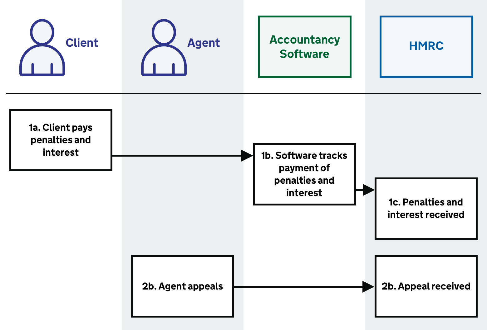
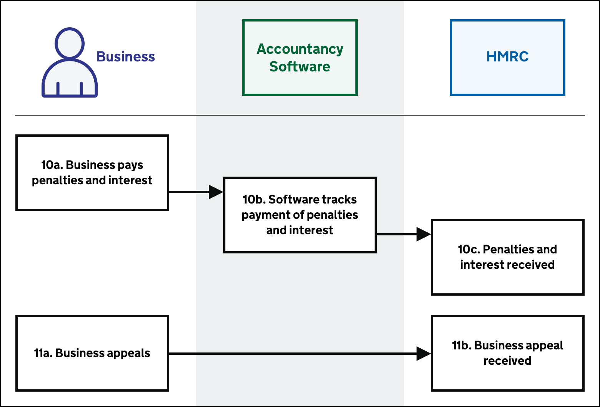

# Penalties and appeals

Agents can also represent their clients during penalty and interest payments as well as appeals.

<ol start="12">
  <li><a href="#pay-penalties-and-interest">Client pays penalties and interest</a></li>
  <li><a href="#appeal">Agent appeals</a></li>
</ol>

The business journey for penalty and interest payments and appeals.

<ol start="10">
  <li><a href="#pay-penalties-and-interest">Business pays penalties and interest</a></li>
  <li><a href="#appeal">Business appeals</a></li>
</ol>

## Pay penalties and interest

Existing penalties and notification methods will remain in place for businesses and agents:

  * Late registration - Factsheet CC/FS11
  * Late Filing - VAT Notice 700/50
  * Late Payment - VAT Notice 700/50
  * Inaccuracy penalties - Factsheet CC/FS7
  * Wrongdoing penalty - Factsheet CC/FS12
  * Retention of records - VAT Notice 700/21
  * Breaches of regulations - VAT Notice 700/21
  * Default interest - VAT Notice 700/43

## Appeal

The existing process for appeals will remain in place. A business or agent may contact HMRC if they have a query about a tax decision. If they don’t understand the decision they can also get advice from HMRC or professional help.
