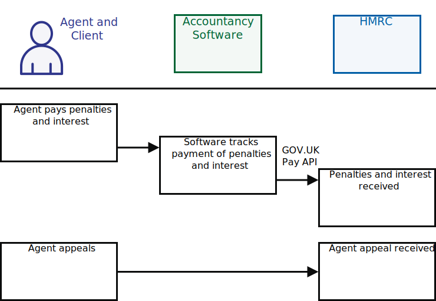

# Penalties and appeals
<!--- Section owner: MTD Programme --->

The way that HMRC levies VAT penalties and interest charges has changed. The changes apply to everyone who submits VAT returns for accounting periods that start on or after 1 January 2023. Penalties for late submission and late payment are considered to be fairer, and will be more consistent across taxes when the reform is extended to other tax regimes in the future.

Businesses that do not submit VAT returns on time will receive penalty points. When the number of penalty points reaches a threshold, HMRC will levy a penalty charge.

Additionally, HMRC will charge late payment interest from the day that a VAT payment is overdue to the day that payment is made in full.

You can find information about the rules and thresholds that relate to late submission and payment penalties on GOV.UK:

  * [Prepare for upcoming changes to VAT penalties and VAT interest charges](https://www.gov.uk/guidance/prepare-for-upcoming-changes-to-vat-penalties-and-vat-interest-charges)
  * [Penalties for late submission](https://www.gov.uk/government/publications/penalties-for-late-submission/penalties-for-late-submission)
  * [Interest harmonisation and penalties for late payment and late submission](https://www.gov.uk/government/publications/interest-harmonisation-and-penalties-for-late-submission-and-late-payment-of-tax/interest-harmonisation-and-penalties-for-late-payment-and-late-submission)

## Retrieve penalty details
<!--- Section owner: MTD Programme --->

Your software should use the VAT (MTD) API to retrieve details of the penalties that have been applied to a VAT account.

<a href="figures/penalties.svg" target="blank">Open the penalties process diagram in a new tab</a>.

Specifically, the software should use this endpoint:

  * [Retrieve VAT penalties](https://developer.service.hmrc.gov.uk/api-documentation/docs/api/service/vat-api/1.0#Retrieve%20VAT%20penalties%20[test%20only])

## Retrieve financial details relating to a penalty
<!--- Section owner: MTD Programme --->

To retrieve the financial details relating to a penalty, use this endpoint:

  * [Retrieve financial details](https://developer.service.hmrc.gov.uk/api-documentation/docs/api/service/vat-api/1.0#Retrieve%20financial%20details%20[test%20only])

Your software should use the financial-details endpoint after the penalties endpoint, passing the late submission or late payment penalty charge reference that the penalties endpoint has returned:

<a href="figures/financial-details.svg" target="blank">Open the financial-details process diagram in a new tab</a>.

## Pay penalties and interest
<!--- Section owner: MTD Programme --->

For accounting periods that started before 1 January 2023,  existing penalties and notification methods will remain in place:

  * [Late registration - Factsheet CC/FS11](https://www.gov.uk/government/publications/compliance-checks-penalties-for-failure-to-notify-ccfs11/compliance-checks-penalties-for-failure-to-notify-ccfs11)
  * [Late Filing - VAT Notice 700/50](https://www.gov.uk/guidance/vat-default-surcharge-notice-70050)
  * [Late Payment - VAT Notice 700/50](https://www.gov.uk/guidance/vat-default-surcharge-notice-70050)
  * [Inaccuracy penalties - Factsheet CC/FS7a](https://www.gov.uk/government/publications/compliance-checks-penalties-for-inaccuracies-in-returns-or-documents-ccfs7a)
  * [Wrongdoing penalty - Factsheet CC/FS12](https://www.gov.uk/government/publications/compliance-checks-penalties-for-vat-and-excise-wrongdoing-ccfs12)
  * [Retention of records - VAT Notice 700/21](https://www.gov.uk/guidance/record-keeping-for-vat-notice-70021)
  * [Breaches of regulations - VAT Notice 700/21](https://www.gov.uk/guidance/record-keeping-for-vat-notice-70021)
  * [Default interest - VAT Notice 700/43](https://www.gov.uk/guidance/default-interest-notice-70043)

For accounting periods that start on or after 1 January 2023, these notices will be issued:

  * Penalty Point Notification - LSP1
  * Late Submission Penalty Notification - LSP2
  * Late Payment Penalty Lower Rate - LPP1
  * Late Payment Penalty Higher Rate - LPP2
  * Second Late Payment Penalty - LPP3
  * [Late registration - Factsheet CC/FS11](https://www.gov.uk/government/publications/compliance-checks-penalties-for-failure-to-notify-ccfs11/compliance-checks-penalties-for-failure-to-notify-ccfs11)
  * [Inaccuracy penalties - Factsheet CC/FS7a](https://www.gov.uk/government/publications/compliance-checks-penalties-for-inaccuracies-in-returns-or-documents-ccfs7a)
  * [Retention of records - VAT Notice 700/21](https://www.gov.uk/guidance/record-keeping-for-vat-notice-70021)
  * [Default interest - VAT Notice 700/43](https://www.gov.uk/guidance/default-interest-notice-70043)

## Appeals
<!--- Section owner: MTD Programme --->

The [existing process for appeals](https://www.gov.uk/tax-appeals/penalty) will remain in place, although a provision will be made to allow the user to appeal their penalties through the digital tax account.

A business or agent may contact HMRC if they have a query about a tax decision. If they don’t understand the decision they can also get advice from HMRC or professional help.
