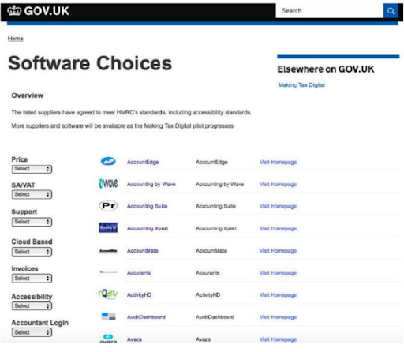

# Set up

## Agent submits a VAT return using the MTD process

Before agents can represent clients they must set up their relationships and software.

<a href="figures/agent-start-up.png" target="blank">Open the diagram in a new tab</a>

1. [Agent reads campaign pages and guidance](#read-campaign-pages-and-guidance)
2. [Agent creates Agent Services account and links existing VAT clients](#create-agent-services-account-and-link-existing-vat-clients)
3. [Agent links new VAT client](#link-new-vat-client)
4. [Agent registers client for MTDfB for VAT](#register-client-for-vat-mtd)
5. [Agent chooses software](#choose-software)
6. [Agent links software to HMRC](#link-software-to-hmrc)

## Business submits a VAT return using the MTD process

Before businesses can submit VAT returns, they must register for VAT and set up their software.

<a href="figures/business-start-up.png" target="blank">Open the diagram in a new tab</a>

1. [Business reads campaign pages and guidance](#read-campaign-pages-and-guidance)
2. [Business registers for MTDfB for VAT](#business-registers-for-vat-mtd)
3. [Business chooses software](#choose-software)
4. [Business links software to HMRC](#link-software-to-hmrc)

## Read campaign pages and guidance

**See the [VAT (MTD) roadmap](https://hmrc-devhub-cycle-33.herokuapp.com/documentation/docs/vat-roadmap) for more details.**

We continue to use GOV.UK as our main way to guide businesses and agents about government services and information, although we will not publish guidance about how to join the VAT pilot until we exit the Controlled Go Live period of the pilot and enter public beta. Initially, the guidance will:

  * signpost a few more detailed, task-based content pages on GOV.UK starting with:
    * an overview of MTD
    * choose software page
    * sign up

  * help build awareness about what MTD means for businesses and agents
  * signpost the route for customer support, including how software developers vendors can contact our HMRC teams
  * manage users' concerns if not eligible yet, or there's no legal requirement for them yet
  * help us manage the messages businesses and agents need to know over coming months and years - who is eligible, why signing up early might help you, when this will become mandatory and so on

As we make more functionality live, we’ll add more task-based guidance onto GOV.UK to ensure that businesses and agents can continue their journey. For example, 'Sign up to report VAT through software', 'Choose software' and so on.

As MTD becomes more mainstream, we will reduce campaign content and presence.

We would like software applications to make businesses and agents aware of the links to the guidance detailed above if they are interested in the service.

## Create agent services account and link existing VAT clients

### Create an agent services account

An agent must create an agent services account and connect it to their accounting software. The creation of the account is a one-off process that an agency must do to enable its agents to access Making Tax Digital through this one account and act for their clients.

The agent does this through their accounting software or from GOV.UK. The agent must:

  * create a new Government Gateway ID which will be the agency’s new Government Gateway ID and password. This will become the agency's user ID and password which is to access all our new HMRC services via accounting software
  * give information about the agency, which is held by us
  * receive an agent reference number, which is the number assigned to all their existing and new clients

<a href="figures/agent-services-account.png" target="blank">Open the diagram in a new tab</a>

1. Agent creates a new Government Gateway ID which becomes the agency's new Government Gateway ID and password.
2. Agent signs in to Government Gateway account with existing agent credentials
3. Agent identifies their agency with its SA UTR or CTR
4. Agent gives their details and email address
5. Agent saves user ID and gateway agent ID
6. Agent gives agency address
7. Agent checks details and creates account
8. Agent saves agent services account number

Live page [www.gov.uk/guidance/get-an-hmrc-agent-services-account](https://www.gov.uk/guidance/get-an-hmrc-agent-services-account)

For Partnerships or a Limited Liability Partnerships you will need to use your Partnership UTR, and not the UTR for each partner or LL partner.

### Link existing VAT clients

_DIAGRAM GOES HERE_

1. Agent starts journey to to add existing clients
2. Agent signs in to Government Gateway account with agent credentials for existing clients
3. Agent enters agency account number and their SA UTR or CTR
4. Connection to existing clients is confirmed for that Government Gateway account
5. Agent repeats the process with next Government Gateway account that has existing clients until all clients are linked

After an agent creates an agent services account, they link their existing VAT clients to the account. When a client subscribes to MTD, the agent can:

  * view the client's data
  * submit updates to HMRC

To link their existing VAT clients to the agent services account the agent must:

  * sign in with each Government Gateway ID that is currently used to access HMRC online services. If an agent currently has ten Government Gateway IDs they must do this ten times.
  * submit their firm's SA or CT UTR and agent reference number. This links existing VAT clients linked to a particular Government Gateway ID to the new Agent services account.

We encourage software developers to ensure their agency customers are aware of the service and give links to more information.

## Link new VAT client

After an agency has created a new Agent services account, they must get authority from each new client they want to represent for MTD. To do this an agent must send a digital request to each new client. The client can accept or reject the request digitally.
To add a client:

1. The agent:
  * clicks the link for adding a client
  * gives the client’s information
  * sends a direct request to the client

2. The client:
  * receives email from the agent and clicks on the link to begin the process
  * logs in with Government Gateway account and completes identity checks
  * accepts or rejects the agent asking to represent them

3. The agent is updated with the client's response. If the client accepts, we disclose the client's MTDfB-VAT data to their agent.

_DIAGRAM GOES HERE_

<ol>
  <li>Agent signs into agent services account</li>
  <li>Agent clicks on link to ask a client to authorise them</li>
  <li>Agent chooses individual or organisation client type</li>
  <li>Agent chooses what authorisation they need from client</li>
  <li>Agent gives client's VRN and VAT registration date</li>
  <li>Agent gets a unique link and sends it to their client in email</li>
  <li>Client receives email from agent and clicks on the link to begin the process</li>
  <li>Client logs in with Gov Gateway account and completes identity checks</li>
  <li>Client confirms authorisation for agent to represent them</li>
</ol>

## Agent registers client for VAT (MTD)

<a href="figures/agents-sign-up.png" target="blank">Open the diagram in a new tab</a>

1. Agent signs in to Government Gateway account
2. Agent confirms VRN of client
3. Agent confirms client is sole trader or limited company
4. Agent confirms client details eg NINO/DOB for sole trader, CRN for limited company
5. Agent confirms client's email address
6. Client verifies their email address
7. Agent agrees to terms of participation for self and client
8. Agent waits 24 hours to see if client is approved to sign up

In April 2018 we delivered the sign-up service that enables existing VAT businesses to move to the VAT (MTD) service. A business that  wants to use VAT (MTD) must sign up before first use, even if they have already signed up for MTD for income tax.
Agents can sign up an existing client’s business. However, the creation of the agent account which is a one-off process must be completed to enable an agency to sign up their clients.

We will develop supporting content that allows a business to identify whether they need to:

  * register for tax and then sign up for MTD
  * sign up only

After a business signs up they are informed of their update obligations.

The sign-up service requests minimal information from the business such as e-mail address. It reuses information provided as part of identity checking.

We will enable customers to register and sign up through GOV.UK. Software developers can also link to the service from their software.

> Note: The link to ‘Choose accounting software’ on the sign-up confirmation page will remain inactive until VAT (MTD) leaves Controlled Go Live.

## Business registers for VAT (MTD)

### Sole trader and limited company can sign up

_DIAGRAM GOES HERE_

1. Business signs in to Government Gateway account
2. Business confirms VRN
3. Business confirms whether it is sole trader or limited company
4. Business completes identity verification (if applicable)
5. If a Limited company, confirms its Company Registration Number
6. Business enters and verifies its email address
7. Business agrees to the terms of participation
8. Business waits 24 hours to see if it is approved to sign up

> Note: The link to ‘Choose accounting software’ on the sign-up confirmation page will remain inactive until VAT (MTD) leaves Controlled Go Live.

## Choose software

**Coming soon - see the [VAT (MTD) roadmap](https://hmrc-devhub-cycle-33.herokuapp.com/documentation/docs/vat-roadmap) for more details.**

We will publish a list of software applications that are VAT (MTD) compatible on GOV.UK so businesses and agents can choose what suits them.

See an example of this format being used for MTD Income Tax: [www.gov.uk/guidance/software-for-sending-income-tax-updates](https://www.gov.uk/guidance/software-for-sending-income-tax-updates).

We are considering the design of this page (see the early draft shown) working with the software industry.

We require that each application offered  to users complies with our Terms of Use [https://developer.service.hmrc.gov.uk/api-documentation/docs/terms-of-use](https://developer.service.hmrc.gov.uk/api-documentation/docs/terms-of-use) which must be accepted by software developers before we issue production credentials.

This is a very early draft of what the software choices page may look like in the future, and continues to be user tested.

## Link software to HMRC

<a href="figures/links-software.png" target="blank">Open the diagram in a new tab</a>

1. Third party software takes the business or the agent to the authorisation endpoint
2. Business or agent views grant authority start page for an overview of the process before starting
3. Business or agent signs in to their Government Gateway account.
4. Business or agent completes 2 step verification if applicable
5. Business or agent completes identity checks if applicable
6. Business or agent grants (or refuses) permission for the software to represent them with HMRC
5. Business or agent is returned to third party software

Businesses and agents using software that connects to Developer Hub APIs must give their software permission to interact with their data and HMRC. They authenticate directly with us using their Government Gateway account, and grant the software the authority to interact with HMRC on their behalf - for a set of functions called API [scopes](https://developer.service.hmrc.gov.uk/api-documentation/docs/reference-guide#scopes).

Agents must sign in to their Government Gateway account with the user ID and password for their agent services account, which was generated as part of the [agent services account journey](set-up.html#create-an-agent-services-account).

We then issue an OAuth 2.0 access token that’s specific to the business or agent. The software must pass this access token in subsequent API requests as explained in authorisation of [user-restricted endpoints](https://developer.service.hmrc.gov.uk/api-documentation/docs/authorisation/user-restricted-endpoints).
