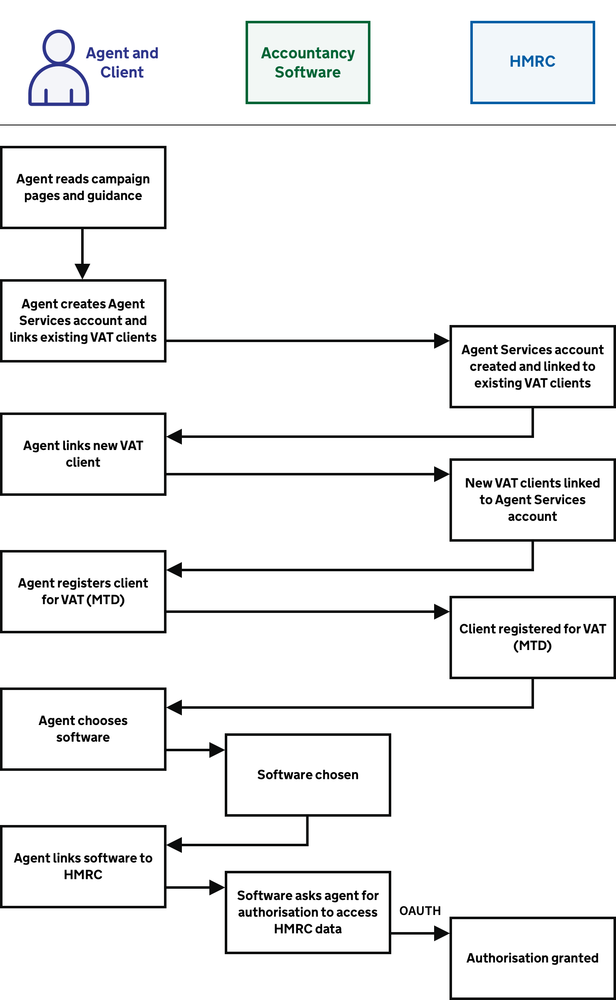
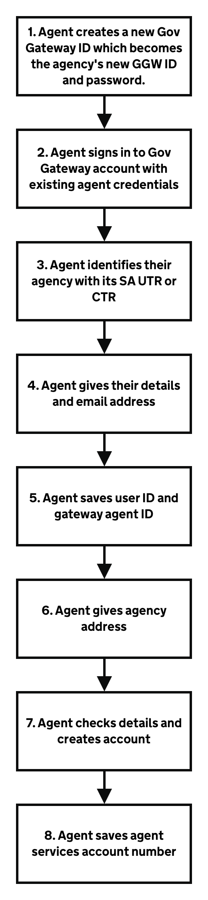
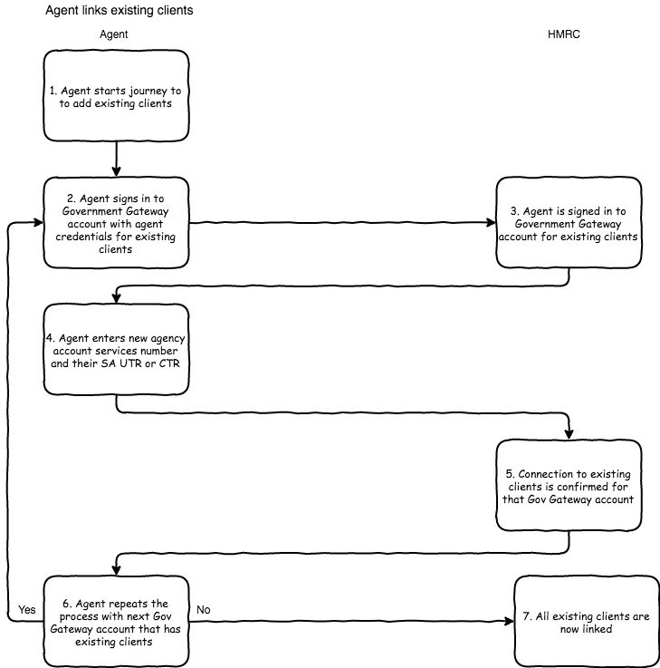
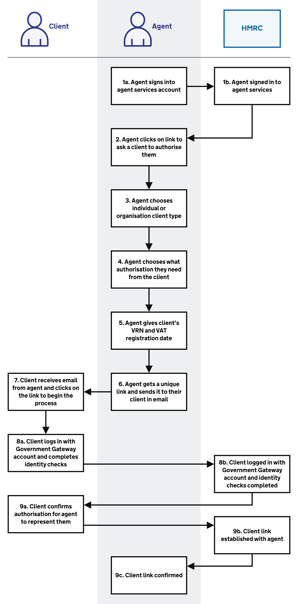
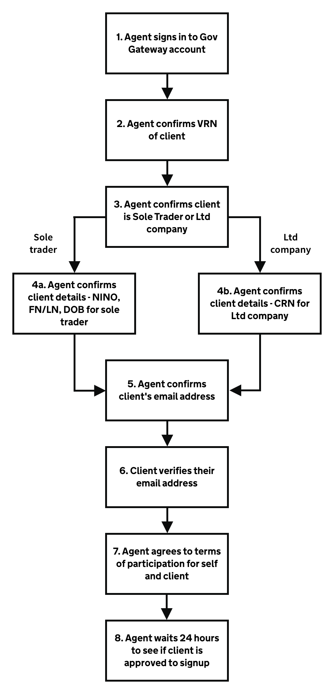
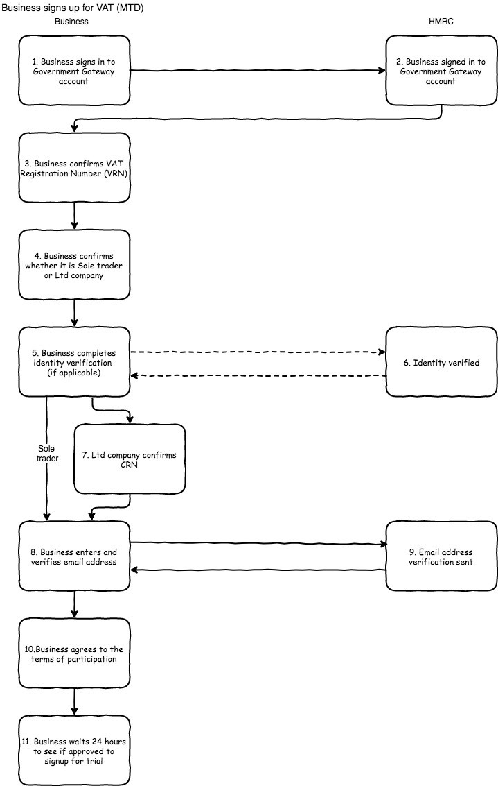
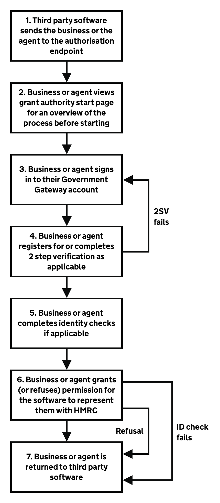

# Set up

## Agent journey overview

Before agents can represent clients they must set up their relationships and software.

<a href="figures/agent-start-up.png" target="blank">Open the agent set up process diagram in a new tab</a>.

1. [Agent reads guidance](#agent-or-business-reads-guidance)
2. [Agent creates an agent services account](#create-an-agent-services-account)
3. [Agent links existing VAT clients](#link-existing-vat-clients)
4. [Agent links a new VAT client](#link-a-new-vat-client)
5. [Agent registers a client for VAT (MTD)](#agent-registers-a-client-for-vat-mtd)
6. [Agent chooses software](#choose-software)
7. [Agent links software to HMRC](#link-software-to-hmrc)

## Business journey overview

Before businesses can submit VAT Returns, they must register for VAT and set up their software.

<a href="figures/business-start-up.png" target="blank">Open the business set up process diagram in a new tab</a>.

1. [Business reads guidance](#agent-or-business-reads-guidance)
2. [Business registers for VAT (MTD)](#business-registers-for-vat-mtd)
3. [Business chooses software](#choose-software)
4. [Business links software to HMRC](#link-software-to-hmrc)

## Read guidance

Your software should include a link to the [guidance to help agents and businesses](https://www.gov.uk/government/publications/making-tax-digital-how-vat-businesses-and-other-vat-entities-can-get-ready) understand how to register themselves and their clients for VAT.

## Create an agent services account

An agent must create an agent services account and connect it to their accounting software. Account creation is a one-off process which enables an agency to access VAT (MTD) and act for their clients.

The agent does this through their accounting software or from GOV.UK. The agent must:

  * create a new Government Gateway ID which will be the agency’s new Government Gateway ID and password. This will become the agency's user ID and password which is to access all our new HMRC services via accounting software
  * give information about the agency, which is held by us
  * receive an agent reference number, which is the number assigned to all their existing and new clients

<a href="figures/agent-services-account.png" target="blank">Open the create an agent services account process diagram in a new tab</a>.

1. Agent creates a new Government Gateway ID which becomes the agency's new Government Gateway ID and password.
2. Agent signs in to Government Gateway account with existing agent credentials
3. Agent identifies their agency with its SA UTR or CTR
4. Agent gives their details and email address
5. Agent saves user ID and gateway agent ID
6. Agent gives agency address
7. Agent checks details and creates account
8. Agent saves agent services account number

For partnerships or limited liability partnerships you will need to use your partnership UTR, and not the UTR for each partner.

View the start page at [www.gov.uk/guidance/get-an-hmrc-agent-services-account](https://www.gov.uk/guidance/get-an-hmrc-agent-services-account).

 
This video explains the step-by-step process for creating an agent services account.
 
 

<iframe width="560" height="315" src="https://www.youtube.com/embed/scHXKhu4QnI" frameborder="0" allow="accelerometer; autoplay; encrypted-media; gyroscope; picture-in-picture" allowfullscreen></iframe>

## Link existing VAT clients

After an agent creates an agent services account, they link their existing VAT clients to the account.

<a href="figures/link-existing-vat-clients.png" target="blank">Open the link existing VAT clients process diagram in a new tab</a>.

1. Agent starts journey to add existing clients
2. Agent signs in with each existing Government Gateway ID that is currently used to access HMRC online services
3. Agent enters agent services account number and their SA UTR or CTR
4. Connection to existing clients is confirmed for that Government Gateway account
5. Agent repeats the process with next Government Gateway account that has existing clients until all clients are linked. For example, if an agent currently has ten Government Gateway IDs they must do this ten times

We encourage you to ensure your agency users are aware of the service and give them links to more information.

## Link a new VAT client

After an agent creates an agent services account, they must get authority from each new client they want to represent. To do this an agent must send an email request to each new client. The client can accept or decline the request digitally.
To link a new client:

1. The agent:
  * clicks the agent services account link to ask a client to authorise them
  * gives the client’s information
  * sends an email request to the client

2. The client:
  * receives email from the agent and clicks on the link to begin the process
  * logs in with their Government Gateway account and completes identity checks
  * accepts or declines the agent asking to represent them

3. The agent gets an update on the client's response. If they accepted, we disclose the client's VAT data to their agent.

<a href="figures/agent-links-new-vat.png" target="blank">Open the agent links new VAT clients process diagram in a new tab</a>.

<ol>
  <li>Agent signs into agent services account</li>
  <li>Agent clicks on link to ask a client to authorise them</li>
  <li>Agent chooses individual or organisation client type</li>
  <li>Agent chooses what authorisation they need from client</li>
  <li>Agent gives client's VRN and VAT registration date</li>
  <li>Agent gets a unique link and sends it to their client in email</li>
  <li>Client receives email from agent and clicks on the link to begin the process</li>
  <li>Client logs in with Gov Gateway account and completes identity checks</li>
  <li>Client confirms authorisation for agent to represent them</li>
</ol>

## Agent registers a client for VAT (MTD)

Agents can sign up an existing client’s business.

<a href="figures/agents-sign-up.png" target="blank">Open the agent registers client for VAT process diagram in a new tab</a>.

1. Agent signs in to agent services Government Gateway account
2. Agent confirms VRN of client
3. Agent confirms client is sole trader or limited company
4. Agent confirms client details, for example NINO/DOB for sole trader, CRN for limited company
5. Agent confirms their own email address
6. Agent signs up client to receive emails
7. Agent confirms client's email address
8. Client verifies their email address
7. Agent agrees to terms of participation for self and client
8. Agent waits 24 hours to see if client is approved to sign up

We will develop supporting content that allows a business to identify whether they need to:

  * register for VAT and then sign up for VAT (MTD)
  * sign up for VAT (MTD) only

After a business signs up they are informed of their update obligations.

We will enable businesses or agents to register and sign up through GOV.UK. We encourage you to link to the service from your software.

## Business registers for VAT (MTD)

Sole traders and limited companies can sign up for VAT (MTD). They must sign up before first use, even if they have already signed up for VAT (MTD) for Income Tax.

<a href="figures/business-registers-vat.png" target="blank">Open the business registers for VAT process diagram in a new tab</a>.

1. Business signs in to Government Gateway account
2. Business confirms VRN
3. Business confirms whether it is sole trader or limited company
4. Business completes identity verification (if applicable)
5. If a limited company, confirms its Company Registration Number
6. Business enters and verifies its email address
7. Business agrees to the terms of participation
8. Business waits 24 hours to see if it is approved to sign up

 
This video explains the step-by-step process for a business to sign up to VAT (MTD).
 
 

<iframe width="560" height="315" src="https://www.youtube.com/embed/kOKD4kHvlzI" frameborder="0" allow="accelerometer; autoplay; encrypted-media; gyroscope; picture-in-picture" allowfullscreen></iframe>

## Choose software

Here is a list of [software applications that are VAT (MTD) compatible](https://www.gov.uk/guidance/software-for-sending-income-tax-updates) so businesses and agents can choose the right software for their needs.

This video is about the compatible software that businesses and agents must use as part of VAT (MTD).
 
 

<iframe width="560" height="315" src="https://www.youtube.com/embed/LDGxLwEc1OM" frameborder="0" allow="accelerometer; autoplay; encrypted-media; gyroscope; picture-in-picture" allowfullscreen></iframe>

 

We require that each application offered to users complies with our [terms of use](https://developer.service.hmrc.gov.uk/api-documentation/docs/terms-of-use) which must be accepted by you as software developers before we will issue its production credentials.

## Link software to HMRC

Businesses and agents using software that connects to the VAT (MTD) API must grant authority to the software to interact with HMRC on their behalf. We use the open standard [OAuth 2.0 (opens in a new tab)](https://oauth.net/2/) to do this, which involves the business or agent signing in via their Governmant Gateway account and following the HMRC authorisation journey to grant this authority.

<a href="figures/links-software.png" target="blank">Open the links software to HMRC process diagram in a new tab</a>.

1. Your software sends the business or the agent to the authorisation endpoint
2. Business or agent views grant authority start page for an overview of the process before starting
3. Business or agent signs in to their Government Gateway account
4. Business or agent registers for or completes 2-step verification as applicable
5. Business or agent completes identity checks if applicable
6. Business or agent grants (or refuses) authority for the software to interact with HMRC on their behalf
7. Business or agent is returned to your software

Business and agents authenticate directly with us using their Government Gateway account, and grant the software the authority to interact with HMRC on their behalf. They grant this for a set of functions called API scopes which are required for [each VAT (MTD) endpoint](https://developer.service.hmrc.gov.uk/api-documentation/docs/api/service/vat-api/1.0#resources).

In the case of agents, they must sign in to their Government Gateway account with the user ID and password for their agent services account, which was generated as part of the [agent services account journey](set-up.html#create-an-agent-services-account).

We then issue an OAuth 2.0 access token to the software which is specific to the business or agent. The software must pass this access token in subsequent API requests as explained in authorisation of [user-restricted endpoints](https://developer.service.hmrc.gov.uk/api-documentation/docs/authorisation/user-restricted-endpoints).
