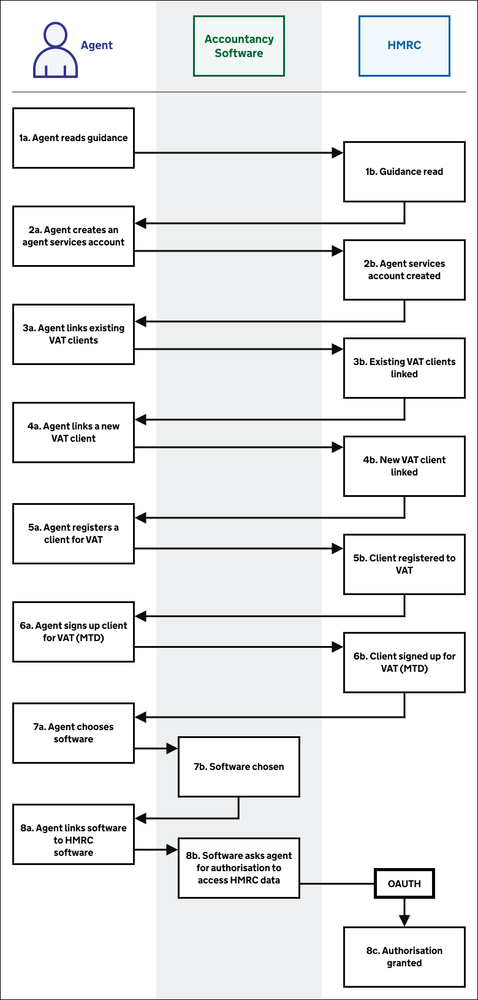
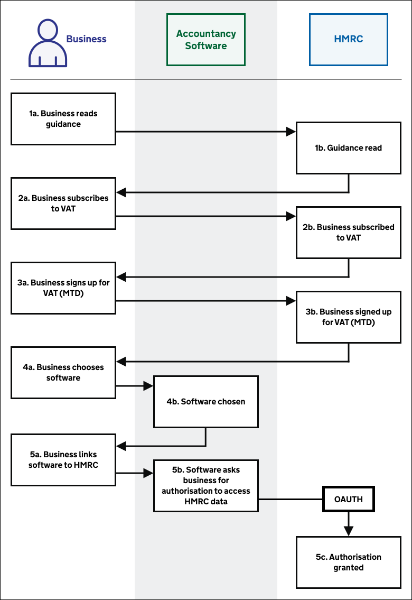
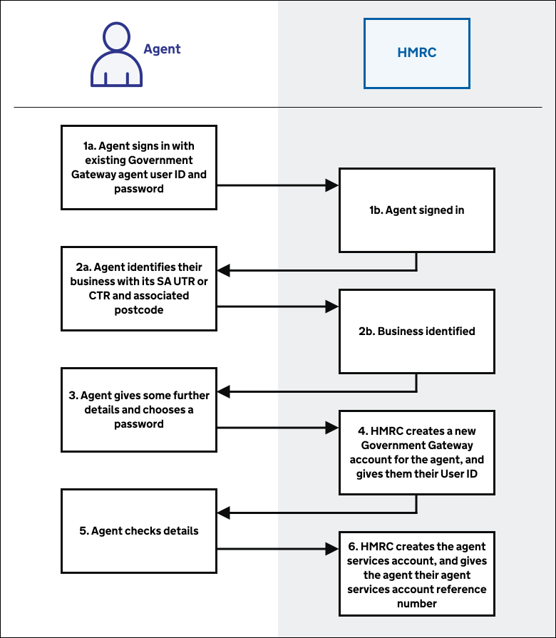
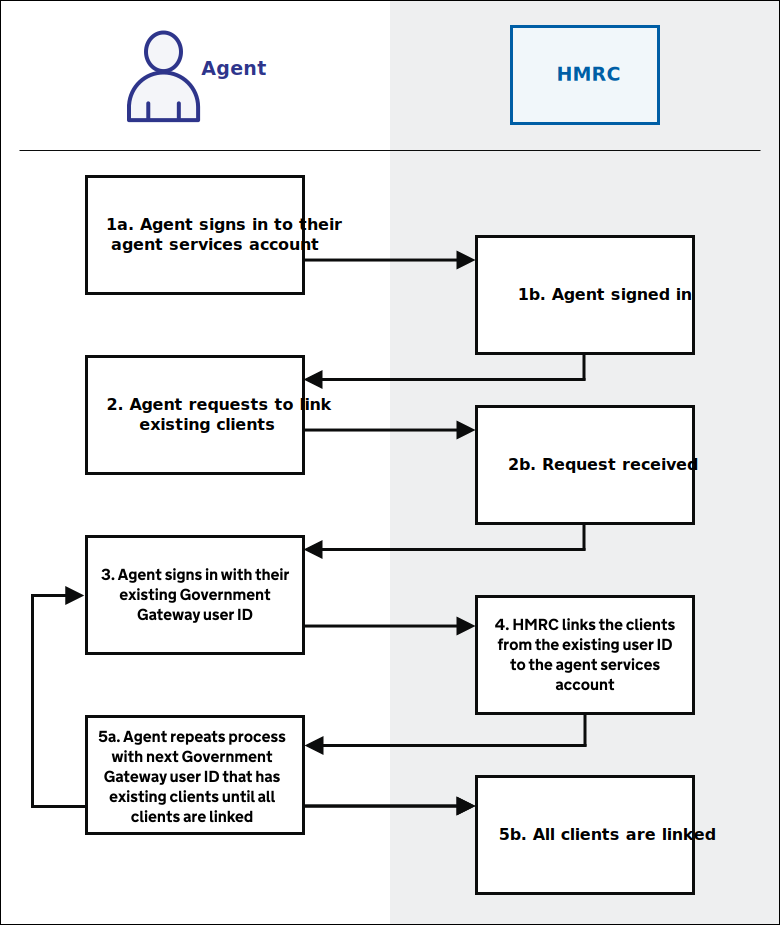
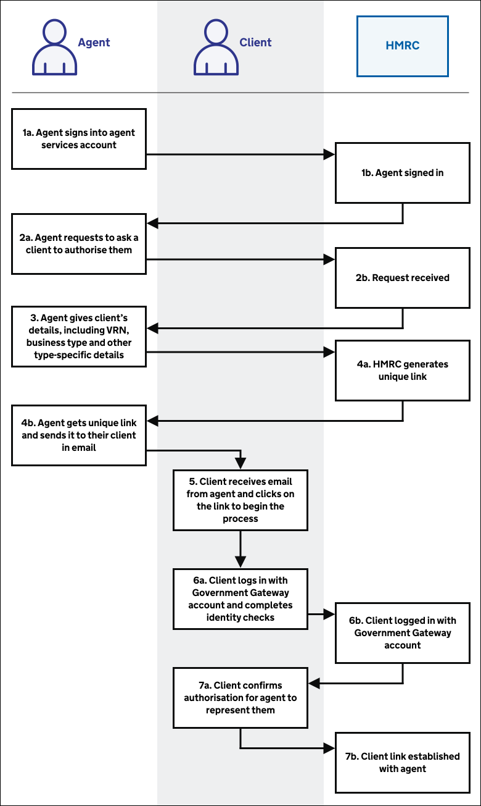
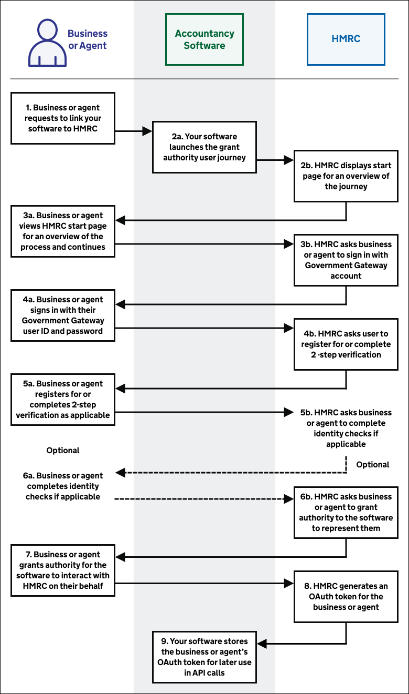

# Set up

## Agent journey overview 
<!--- Section owner: MTD Programme --->

Before agents can represent clients they must set up their relationships and software.

<a href="figures/agent-journey-overview.svg" target="blank">Open the agent set up process diagram in a new tab</a>.

1. [Agent reads guidance](#read-guidance)
2. [Agent creates an agent services account](#create-an-agent-services-account)
3. [Agent links existing VAT clients](#link-existing-vat-clients)
4. [Agent links a new VAT client](#link-a-new-vat-client)
5. [Agent registers a client for VAT](#register-for-vat)
6. [Agent signs up clients for Making Tax Digital (MTD) for VAT](#agent-signs-up-client-for-vat-mtd)
7. [Agent chooses software](/guides/vat-mtd-end-to-end-service-guide/#software-choices)
8. [Agent links software to HMRC](#link-software-to-hmrc)

## Business journey overview 
<!--- Section owner: MTD Programme --->

Before businesses can submit VAT Returns, they must sign up for VAT (MTD) and set up their software.

<a href="figures/business-journey-overview.svg" target="blank">Open the business set up process diagram in a new tab</a>.

1. [Business reads guidance](#read-guidance)
2. [Business registers for VAT](#register-for-vat)
3. [Business signs up for Making Tax Digital (MTD) for VAT  (MTD)](#business-signs-up-for-making-tax-digital-mtd-for-vat)
4. [Business chooses software](/guides/vat-mtd-end-to-end-service-guide/#software-choices)
5. [Business links software to HMRC](#link-software-to-hmrc)

## Read guidance 
<!--- Section owner: MTD Programme --->

Businesses and agents can learn about VAT (MTD) by reading guidance on GOV.UK. In particular:

* [Making Tax Digital: how VAT businesses and other VAT entities can get ready](https://www.gov.uk/government/publications/making-tax-digital-how-vat-businesses-and-other-vat-entities-can-get-ready)
* [Use software to submit your VAT Returns](https://www.gov.uk/guidance/use-software-to-submit-your-vat-returns) - guidance for businesses, including various links to get started
* [Agents: use software to submit VAT Returns](https://www.gov.uk/guidance/agents-use-software-to-submit-vat-returns) - guidance for agents, including various links to get started

We encourage you to include links to the relevant guidance in your software.

## Create an agent services account 
<!--- Section owner: Agents --->

To access VAT (MTD), an agent must create an [agent services account](https://www.gov.uk/guidance/get-an-hmrc-agent-services-account). This is a one-off process.

<a href="figures/create-an-agent-services-account.svg" target="blank">Open the create an agent services account process diagram in a new tab</a>.

1. Agent signs in with existing Government Gateway agent user ID and password
2. Agent identifies their business with its Self Assessment Unique Taxpayer Reference (SA UTR) or Corporation Tax Reference (CTR) and associated postcode
3. Agent gives some further details
4. HMRC creates a new Government Gateway account for the agent, and gives them their user ID
5. Agent checks details
6. HMRC creates the agent services account, and gives the agent their agent services account reference number

This service is available on GOV.UK at [www.gov.uk/guidance/get-an-hmrc-agent-services-account](https://www.gov.uk/guidance/get-an-hmrc-agent-services-account). We encourage you to include this link in your software.

## Link existing VAT clients 
<!--- Section owner: Agents --->

After an agent creates an agent services account, they link their existing VAT clients to the account.

<a href="figures/link-existing-vat-clients.svg" target="blank">Open the link existing VAT clients process diagram in a new tab</a>.

1. Agent signs in to their agent services account
2. Agent requests to link existing clients
3. Agent signs in with their existing Government Gateway user ID
4. HMRC links the clients from the existing user ID to the agent services account
5. Agent repeats the process with next Government Gateway user ID that has existing clients until all clients are linked. For example, if an agent currently has ten Government Gateway user IDs they must do this ten times

This service is available on GOV.UK at [www.gov.uk/guidance/get-an-hmrc-agent-services-account](https://www.gov.uk/guidance/get-an-hmrc-agent-services-account). We encourage you to include this link in your software.

## Link a new VAT client 
<!--- Section owner: Agents --->

After an agent creates an agent services account, they must link any new clients to the account one by one.

<a href="figures/link-a-new-vat-client.svg" target="blank">Open the link a new VAT client process diagram in a new tab</a>.

1. Agent signs into agent services account
2. Agent requests to ask a client to authorise them
3. Agent gives client's details including their VAT registration number (VRN) and VAT registration date
4. Agent gets a unique link and sends it to their client in email
5. Client receives email from agent and clicks on the link to begin the process
6. Client logs in with Government Gateway account and completes identity checks
7. Client confirms authorisation for agent to represent them

This service is available on GOV.UK at [www.gov.uk/guidance/get-an-hmrc-agent-services-account](https://www.gov.uk/guidance/get-an-hmrc-agent-services-account). We encourage you to include this link in your software.

## Register for VAT 
<!--- Section owner: SABR --->

### For businesses

Since April 2019, most VAT registered businesses, and agents acting on their behalf, have been required to keep digital records using HMRC compatible software. This is known as Making Tax Digital for VAT (MTD).

When the taxable turnover goes above the VAT threshold, the business must sign up to MTD and use their software to:

* keep their VAT records
* send their VAT Returns direct to HMRC

Most modern accounting software can do this already but the business should check if theirs is compatible.

### For agents

Accountants and tax advisers need an [Agent services account](https://www.gov.uk/guidance/sign-in-to-your-agent-services-account) to sign up their clients to Making Tax Digital for VAT. They’ll need to sign clients up individually as it’s currently not possible to sign all their clients up at the same time.

### Future developments

In the future, new businesses will be able to register for VAT and sign up to Making Tax Digital at the same time.

Until then, businesses should:

* register for VAT using the current VAT registration service
* complete the sign-up process and provide information about the business and the person running it

After signing up, the business will receive details of when they should submit their VAT Return. These details can also be found in their HMRC services account.

Agents must already be subscribed to HMRC agent services to access the new VAT registration service on behalf of their clients.

## Agent signs up clients for Making Tax Digital (MTD) for VAT
<!--- Section owner: SABR --->

Before signing up clients to MTD for VAT, agents must first create a relationship by linking clients to their agent services account.

Once an agent has linked all clients to their agent services account, they can sign them up.

### The process for agents signing up their clients

1. Sign into HMRC online services using agent services account.
2. Provide client details including VAT registration and client’s business type.
3. Give and verify agent’s own email address. This is only required once.
4. Choose whether client prefers to get emails or letters.
5. Enter client’s business email address.
6. Tell clients they’ll get a verification email with a link to click on. This will verify their business email address.The link will expire after 3 days.
7. Confirm all information is correct before submitting it to HMRC.
8. Wait to hear if the client is approved. This can take up to 3 days.

The agent can now file VAT Returns for their client.

Agents can complete the sign-up process without having to wait for their clients to verify their own email address.

### Future developments
In the future, agents will be able to do the following in one single process:

* create a new company
* register the new company for VAT
* get the new company’s VAT registration number
* sign up the new company for Making Tax Digital for VAT
* use software to file and send client VAT Returns to HMRC

There’s an easy to follow step by step guide for agents on GOV.UK at [Making Tax Digital for VAT as an agent](https://www.gov.uk/guidance/agents-use-software-to-submit-vat-returns)

## Business signs up for Making Tax Digital (MTD) for VAT
<!--- Section owner: SABR --->

Business owners can sign up for MTD for VAT either directly or through an agent. They must complete the sign up process completely before using the service.

They need to sign up before first use, even if they have already signed up for MTD for Income Tax.

### The process for businesses signing up

1. Sign into HMRC online services using Government Gateway user ID and password.
2. Provide or confirm the VAT registration number.
3. Select business type and give other business information.
4. Choose preferred way of being contacted.
5. Confirm and submit information.
6. Wait up to 3 days to see if the sign up has been approved.
7. Receive confirmation that the business can now start submitting VAT Returns using compatible accounting software.

## Link software to HMRC 
<!--- Section owner: API Services --->

Businesses and agents using your software to connect to the VAT (MTD) API must grant authority to your software to interact with HMRC on their behalf. We use the open standard [OAuth 2.0 (opens in a new tab)](https://oauth.net/2/), which involves the business or agent signing in via their Government Gateway account and following the grant authority user journey.

<a href="figures/link-software-to-hmrc.svg" target="blank">Open the link software to HMRC process diagram in a new tab</a>.

1. Business or agent requests to link your software to HMRC
2. Your software launches the grant authority user journey
3. Business or agent views the HMRC start page for an overview of the process and chooses to continue
4. Business or agent signs in with their Government Gateway user ID and password (agents must use their new agent services user ID)
5. Business or agent registers for or completes 2-step verification as applicable
6. Business or agent completes identity checks if applicable
7. Business or agent grants authority for the software to interact with HMRC on their behalf
8. HMRC generates an OAuth token for the business or agent
9. Your software stores the business or agent's OAuth token for later use in API calls on their behalf

Business and agents authenticate directly with us using their Government Gateway user ID and password, and grant the software the authority to interact with HMRC on their behalf. They grant this for a set of functions called API scopes which are required for [each VAT (MTD) endpoint](https://developer.service.hmrc.gov.uk/api-documentation/docs/api/service/vat-api/1.0#resources).

In the case of agents, they must sign in to their Government Gateway account with the user ID and password for their new agent services account, which was generated as part of the [agent services account journey](set-up.html#create-an-agent-services-account).

We then generate an OAuth 2.0 access token for the software which is specific to the business or agent. The software must pass this access token in subsequent API requests as explained in authorisation of [user-restricted endpoints](https://developer.service.hmrc.gov.uk/api-documentation/docs/authorisation/user-restricted-endpoints).
