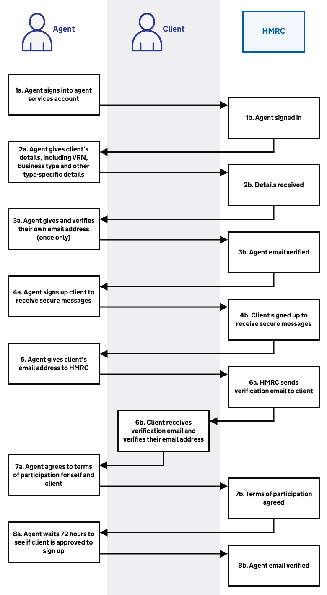
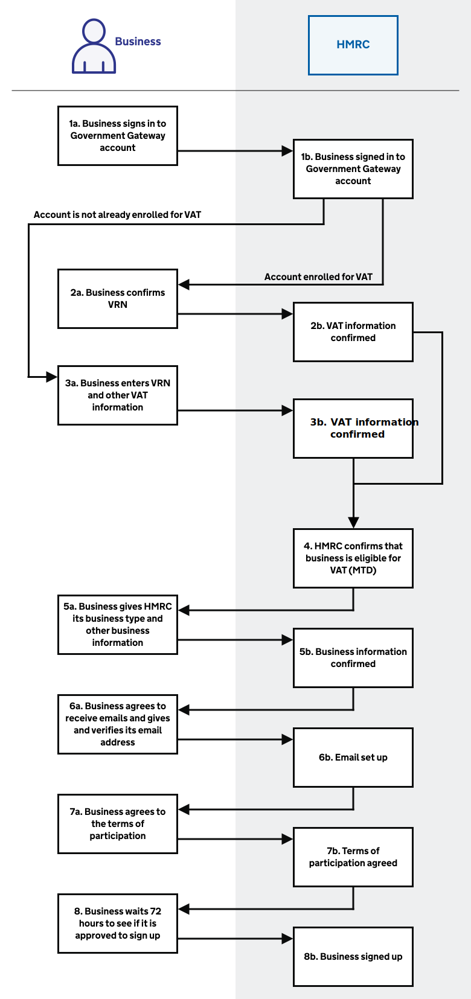

# Set up

## Agent journey overview

Before agents can represent clients they must set up their relationships and software.

<a href="figures/agent-journey-overview.svg" target="blank">Open the agent set up process diagram in a new tab</a>.

1. [Agent reads guidance](#read-guidance)
2. [Agent creates an agent services account](#create-an-agent-services-account)
3. [Agent links existing VAT clients](#link-existing-vat-clients)
4. [Agent adds a new VAT client](#add-a-new-vat-client)
5. [Agent registers a client for VAT](#register-for-vat)
6. [Agent signs up client for VAT (MTD)](#agent-signs-up-client-for-vat-mtd)
7. [Agent chooses software](#choose-software)
8. [Agent links software to HMRC](#link-software-to-hmrc)

## Business journey overview

Before businesses can submit VAT Returns, they must sign up for VAT (MTD) and set up their software.

<a href="figures/business-journey-overview.svg" target="blank">Open the business set up process diagram in a new tab</a>.

1. [Business reads guidance](#read-guidance)
2. [Business registers for VAT](#register-for-vat)
3. [Business signs up for VAT (MTD)](#business-signs-up-for-vat-mtd)
4. [Business chooses software](#choose-software)
5. [Business links software to HMRC](#link-software-to-hmrc)

## Read guidance

Businesses and agents can learn about VAT (MTD) by reading guidance on GOV.UK. In particular:

* [Making Tax Digital: how VAT businesses and other VAT entities can get ready](https://www.gov.uk/government/publications/making-tax-digital-how-vat-businesses-and-other-vat-entities-can-get-ready)
* [Use software to submit your VAT Returns](https://www.gov.uk/guidance/use-software-to-submit-your-vat-returns) - guidance for businesses, including various links to get started
* [Agents: use software to submit VAT Returns](https://www.gov.uk/guidance/agents-use-software-to-submit-vat-returns) - guidance for agents, including various links to get started

We encourage you to include links to the relevant guidance in your software.

## Create an agent services account

To access VAT (MTD), an agent must create an [agent services account](https://www.gov.uk/guidance/get-an-hmrc-agent-services-account). This is a one-off process.

<a href="figures/create-an-agent-services-account.svg" target="blank">Open the create an agent services account process diagram in a new tab</a>.

1. Agent signs in with existing Government Gateway agent user ID and password
2. Agent identifies their business with its Self Assessment Unique Taxpayer Reference (SA UTR) or Corporation Tax Reference (CTR) and associated postcode
3. Agent gives some further details
4. HMRC creates a new Government Gateway account for the agent, and gives them their user ID
5. Agent checks details
6. HMRC creates the agent services account, and gives the agent their agent services account reference number

This service is available on GOV.UK at [www.gov.uk/guidance/get-an-hmrc-agent-services-account](https://www.gov.uk/guidance/get-an-hmrc-agent-services-account). We encourage you to include this link in your software.

 
This video explains the step-by-step process for creating an agent services account.
 
 

<iframe width="560" height="315" src="https://www.youtube.com/embed/scHXKhu4QnI" frameborder="0" allow="accelerometer; autoplay; encrypted-media; gyroscope; picture-in-picture" allowfullscreen></iframe>

## Link existing VAT clients

After an agent creates an agent services account, they link their existing VAT clients to the account.

<a href="figures/link-existing-vat-clients.svg" target="blank">Open the link existing VAT clients process diagram in a new tab</a>.

1. Agent signs in to their agent services account
2. Agent requests to link existing clients
3. Agent signs in to their existing Government Gateway user ID
4. HMRC links the clients from the existing user ID to the agent services account
5. Agent repeats the process with next Government Gateway user ID that has existing clients until all clients are linked. For example, if an agent currently has ten Government Gateway user IDs they must do this ten times

This service is available on GOV.UK at [www.gov.uk/guidance/get-an-hmrc-agent-services-account](https://www.gov.uk/guidance/get-an-hmrc-agent-services-account). We encourage you to include this link in your software.

## Add a new VAT client

After an agent creates an agent services account, they must add any new clients to the account one by one.

<a href="figures/link-a-new-vat-client.svg" target="blank">Open the add a new VAT client process diagram in a new tab</a>.

1. Agent signs into agent services account
2. Agent requests to ask a client to authorise them
3. Agent gives client's details including their VAT registration number (VRN) and VAT registration date
4. Agent gets a unique link and sends it to their client in email
5. Client receives email from agent and clicks on the link to begin the process
6. Client logs in with Government Gateway account and completes identity checks
7. Client confirms authorisation for agent to represent them

This service is available on GOV.UK at [www.gov.uk/guidance/get-an-hmrc-agent-services-account](https://www.gov.uk/guidance/get-an-hmrc-agent-services-account). We encourage you to include this link in your software.

## Register for VAT

This does not apply for businesses or clients who are already VAT registered and have a VAT Registration Number (VRN).

Post April 2019 we will deliver a VAT Registration service that will allow businesses new to VAT to subscribe at the same time as they sign up to VAT (MTD).

Until this service is delivered, new businesses will need to register for VAT using the existing service, then navigate to the VAT (MTD) sign up service and complete that journey. The service will request information about the business and the person running it. Following
successful registration the business will be informed of their VAT Return deadlines.

Agents must already be subscribed to HMRC agent services in order to access the new VAT registration service on behalf of their clients.

## Agent signs up client for VAT (MTD)

Once an agent has linked a client to their agent services account, they can sign them up for VAT (MTD).

<a href="figures/agent-signs-up-client-for-vat.svg" target="blank">Open the agent signs up client for VAT (MTD) process diagram in a new tab</a>.

1. Agent signs in to agent services account
2. Agent gives client's details, including VRN, business type and other type-specific details
3. Agent gives and verifies their own email address (once only)
4. Agent signs up client to receive secure messages
5. Agent gives client's email address to HMRC
6. Client receives verification email and verifies their email address
7. Agent agrees to terms of participation for self and client
8. Agent waits 72 hours to see if client is approved to sign up

Note: Agents do not need to wait for client email verification before proceding to agree the terms of participation.

We will develop supporting content that allows a business to identify whether they need to:

  * register for VAT and then sign up for VAT (MTD)
  * sign up for VAT (MTD) only

This service is available on GOV.UK at [https://www.gov.uk/guidance/agents-use-software-to-submit-vat-returns](https://www.gov.uk/guidance/agents-use-software-to-submit-vat-returns). We encourage you to include this link in your software.

## Business signs up for VAT (MTD)

Businesses can sign themselves up for VAT (MTD) whether or not they use an agent. They must sign up before first use, even if they have already signed up for VAT (MTD) for Income Tax.

<a href="figures/business-signs-up-for-vat-mtd.svg" target="blank">Open the business signs for VAT (MTD) process diagram in a new tab</a>.

1. Business signs in to Government Gateway account
2. If the account is already enrolled for VAT, business confirms VRN
3. If the account is not already enrolled for VAT, business enters VRN and other VAT information
4. HMRC confirms that business is eligible for VAT (MTD)
5. Business gives HMRC its business type and other business information
6. Business agrees to receive emails and gives and verifies its email address
7. Business agrees to the terms of participation
8. Business waits 72 hours to see if it is approved to sign up

 
This video explains the step-by-step process for a business to sign up to VAT (MTD).
 
 

<iframe width="560" height="315" src="https://www.youtube.com/embed/kOKD4kHvlzI" frameborder="0" allow="accelerometer; autoplay; encrypted-media; gyroscope; picture-in-picture" allowfullscreen></iframe>

## Choose software

We provide a list of [software applications that are VAT (MTD) compatible](https://www.gov.uk/guidance/software-for-sending-income-tax-updates#VAT) so businesses and agents can choose the right software for their needs.

This video is about the compatible software that businesses and agents must use as part of VAT (MTD).
 
 

<iframe width="560" height="315" src="https://www.youtube.com/embed/LDGxLwEc1OM" frameborder="0" allow="accelerometer; autoplay; encrypted-media; gyroscope; picture-in-picture" allowfullscreen></iframe>

 

Your application must comply with our [terms of use](https://developer.service.hmrc.gov.uk/api-documentation/docs/terms-of-use). You must accept the terms of use before we issue your application's production credentials.

## Link software to HMRC

Businesses and agents using your software to connect to the VAT (MTD) API must grant authority to your software to interact with HMRC on their behalf. We use the open standard [OAuth 2.0 (opens in a new tab)](https://oauth.net/2/), which involves the business or agent signing in via their Government Gateway account and following the grant authority user journey.

<a href="figures/link-software-to-hmrc.svg" target="blank">Open the link software to HMRC process diagram in a new tab</a>.

1. Business or agent requests to link your software to HMRC
2. Your software launches the grant authority user journey
3. Business or agent views the HMRC start page for an overview of the process and chooses to continue
4. Business or agent signs in with their Government Gateway user ID and password (agents must use their new agent services user ID)
5. Business or agent registers for or completes 2-step verification as applicable
6. Business or agent completes identity checks if applicable
7. Business or agent grants authority for the software to interact with HMRC on their behalf
8. HMRC generates an OAuth token for the business or agent
9. Your software stores the business or agent's OAuth token for later use in API calls on their behalf

Business and agents authenticate directly with us using their Government Gateway user ID and password, and grant the software the authority to interact with HMRC on their behalf. They grant this for a set of functions called API scopes which are required for [each VAT (MTD) endpoint](https://developer.service.hmrc.gov.uk/api-documentation/docs/api/service/vat-api/1.0#resources).

In the case of agents, they must sign in to their Government Gateway account with the user ID and password for their new agent services account, which was generated as part of the [agent services account journey](set-up.html#create-an-agent-services-account).

We then generate an OAuth 2.0 access token for the software which is specific to the business or agent. The software must pass this access token in subsequent API requests as explained in authorisation of [user-restricted endpoints](https://developer.service.hmrc.gov.uk/api-documentation/docs/authorisation/user-restricted-endpoints).
